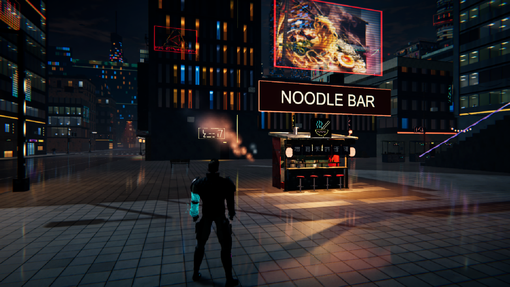
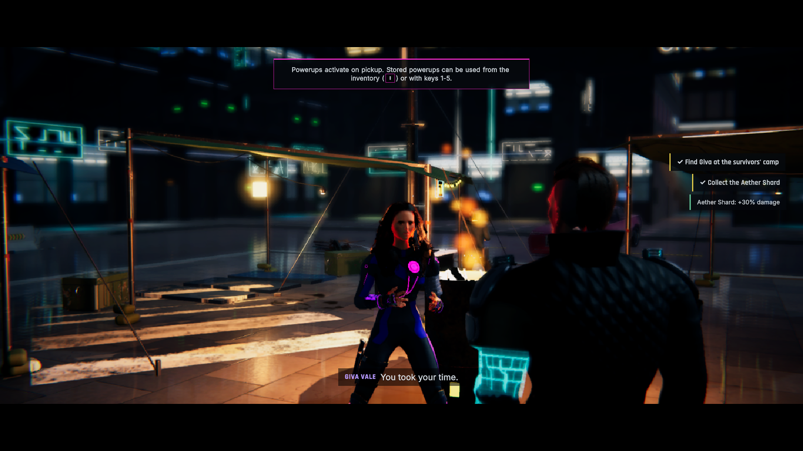
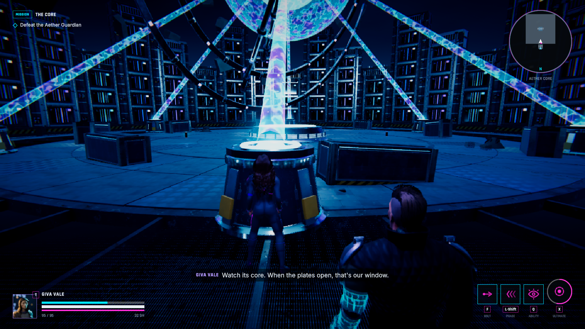
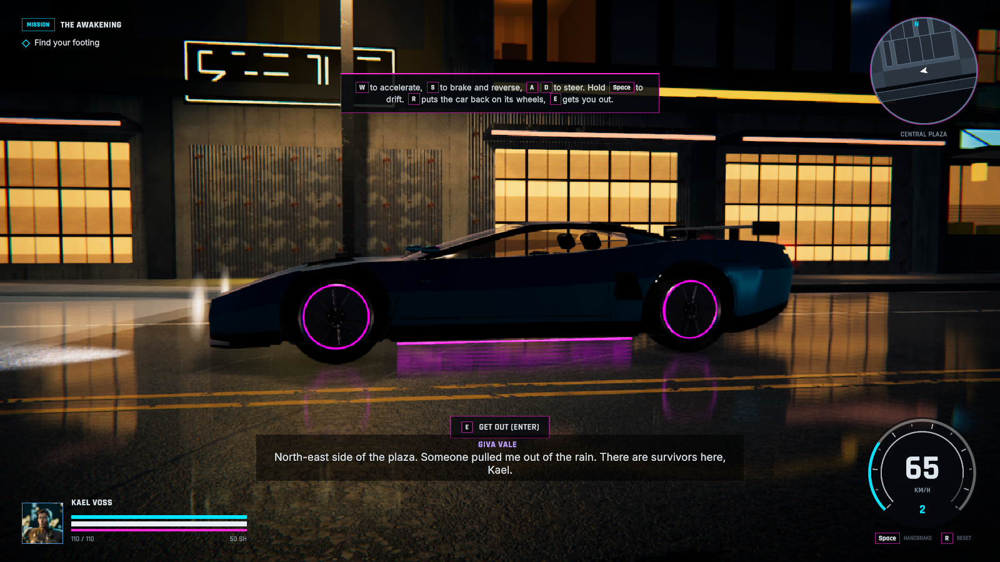
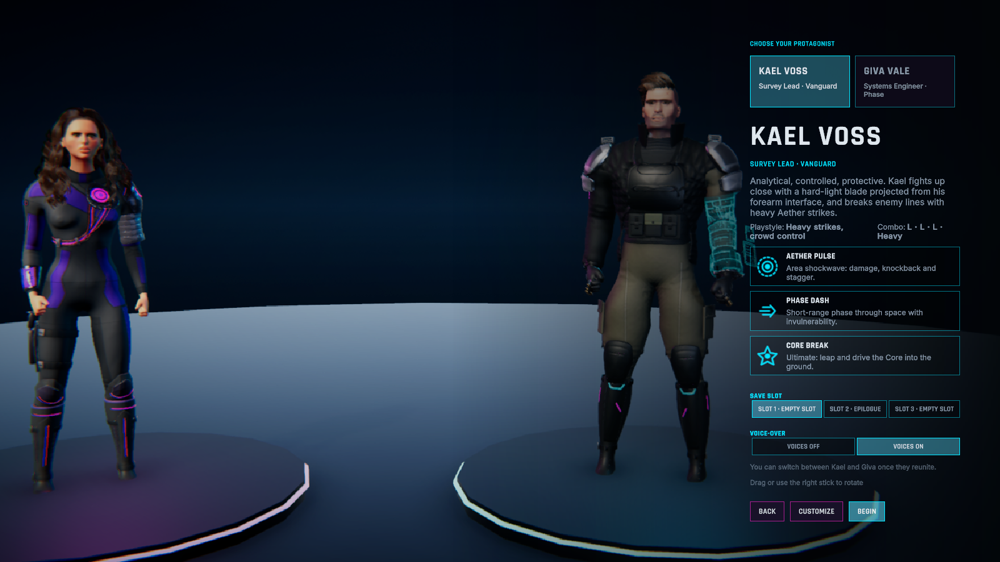
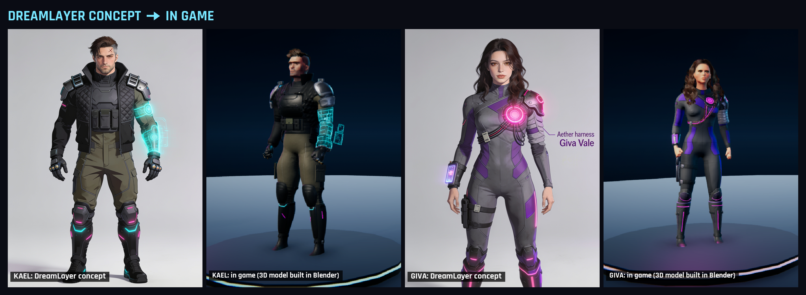
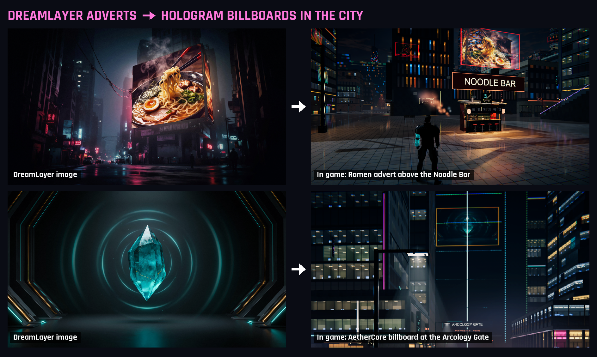

# Echoes of Aether

Two survivors wake in the rain of Aether-9, a neon city that went silent seven years ago. Follow a signal under the
city, fight rogue machines, uncover what Dr. Ilse Maren did to save four thousand people, and decide what to do with
the Core that holds their echoes.

A third-person cyberpunk action-adventure made in Unity 6 and Blender for the **DreamLayer Jam** (October 2026).
About 45 minutes, single player, Windows and macOS.

## Play

Download the game from the itch.io page (Windows 10/11 64-bit, or macOS 12+ on Apple Silicon or Intel), or build it
from this repository (below).

- **Windows:** extract the zip and run `EchoesOfAether.exe`. If "Windows protected your PC" appears, click
  **More info**, then **Run anyway** (the game isn't code-signed).
- **macOS:** unzip and open `EchoesOfAether.app`. The first launch is blocked once because the app isn't notarized:
  on macOS 15 or later use System Settings > Privacy & Security > **Open Anyway**; on macOS 12 to 14 right-click the
  app and choose **Open**.

**Controls:** WASD move, mouse look, Space jump, Shift sprint/dash, left/right mouse light/heavy attack, F Aether
Bolt, Q ability, X ultimate, E interact, T switch hero, **Enter get in or out of a car** (W/S accelerate and brake,
A/D steer, Space handbrake), Esc pause. Gamepads work too, and everything except move, look and pause can be rebound.

## Features

- Two heroes: **Kael** (heavy close combat with a hard-light blade) and **Giva** (speed and Echo Sight). Switch
  between them once they reunite; the other follows as an AI companion.
- Five missions and four side quests across an open cyberpunk district, the metro, a research facility, a vault and
  the Core, with a boss fight, cinematics and voiced dialogue.
- Drivable cars with drifting, crashes, and damage that ends in smoke, fire and explosions.
- Character designer: presets, body, face, hair, glowing tattoos, glasses and armour sets.
- Subtitles, rebindable controls, UI scale, flash and camera-shake limits, three difficulty levels.
- Graphics presets picked from the hardware, lowered automatically if the game runs under 40 fps
  ([measurements](docs/PERFORMANCE.md)).

| | |
|---|---|
|  |  |
|  |  |

## How DreamLayer was used

DreamLayer made 8 images for the game ([log](docs/DREAMLAYER_ASSET_LOG.md)):

- **Hero designs.** One master concept for each hero. The 3D models were built and textured in Blender to match them
  (face, hair, outfit, armour, Kael's holographic forearm interface, Giva's glowing chest core) and checked side by
  side against the concepts in Unity.
- **City adverts.** Six images (ramen, the AetherCore crystal, a cyber implant, a hover-car, techwear fashion, an
  energy drink) play as flickering hologram billboards across the city, such as the giant crystal over the Arcology
  Gate and the ramen advert above the plaza Noodle Bar.

DreamLayer made images only. The 3D models, animation, code and sound were made separately.

## Build from source

1. Install **Unity 6000.3.25f1** (Unity 6.3 LTS) with Windows Build Support (Mono) and/or Mac Build Support.
2. Open `unity/EchoesOfAether` in Unity Hub. Packages (URP 17.3, Input System and others) resolve on first open.
3. Press Play in `Assets/Scenes/Boot.unity`, or build from the **EOA > Build** menu.

On macOS, `tools/build/build_windows.sh` and `tools/build/package_macos.sh` make the release zips.

## Repository layout

| Path | Contents |
|---|---|
| `unity/EchoesOfAether/` | The game: C# scripts, HLSL shaders, characters, city, vehicles, animation, audio, UI |
| `blender/` | Python scripts that build the characters, city, vehicles, robots and weapons in Blender and export them to Unity |
| `dreamlayer/` | The DreamLayer images (hero concepts and adverts) |
| `docs/` | Design, architecture, performance, licences and the DreamLayer log |
| `marketing/` | Store text, cover, screenshots and the DreamLayer before/after images |
| `tools/` | Build, validation and audio scripts |
| `src/`, `index.html` | An early TypeScript/three.js prototype used as the design reference (not the game) |

The Blender working files (`.blend`) and intermediate renders are not in this repository because of their size; the
scripts in `blender/` regenerate them (MakeHuman/MPFB is needed for the characters).

## Credits

Directed and produced by Kartikey. Made with Unity 6 and Blender. Voices: Kokoro-82M text-to-speech (Apache 2.0).
Animation: Universal Animation Library 1 and 2 by Quaternius (CC0) and the CMU Graphics Lab Motion Capture Database
(mocap.cs.cmu.edu). Characters use MakeHuman/MPFB CC0 assets. Fonts: Rajdhani and Inter (SIL OFL 1.1). Concept and
advert images made with DreamLayer. Full list: [docs/THIRD_PARTY_LICENSES.md](docs/THIRD_PARTY_LICENSES.md).
